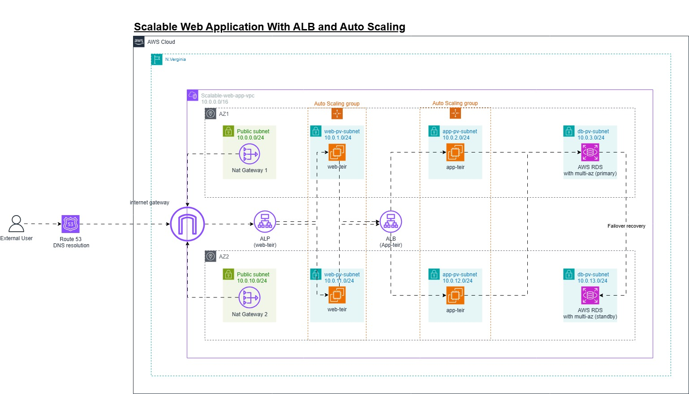

# AWS Architecture: Scalable Web Application

# High-level overview of the project:

## Key AWS Services Used:

* **EC2:** Launch instances for the web app.  
* **Application Load Balancer (ALB):** Distributes traffic across multiple instances.  
* **Auto Scaling Group (ASG):** Ensures instances scale based on demand.  
* **Amazon RDS (Optional):** Backend database (MySQL/PostgreSQL) with Multi-AZ.  
* **IAM:** Role-based access to instances.  
* **CloudWatch & SNS:** Monitor performance and send alerts. **(To Be added)** 

## Some Notes

* AWS NAT Gateways are provided in case the EC2 instances need to be updated or batched

## 

## Project Flow:

1. An external user types the DNS name of the website  
2. AWS Route 53 resolves the DNS record and redirects the request to the ALB(Web Tier)   
3. The request passes through the VPC Internet Gateway to access the public ALB  
4. The ALB redistributes the traffic to the EC2 instances under the ASG attached to the ALB on the web tier.  
5. When the web tier has a request for the application tier, it sends the request to the ALB (App Tier) endpoint, and then it does the same load balancing among the App Tier EC2 instances.  
6. When the Application needs to query data from the database, it queries this data from RDS (primary)  
7. In case of the failure of the primary RDS instance, multi-AZ is enabled to recover with minimum downtime.
